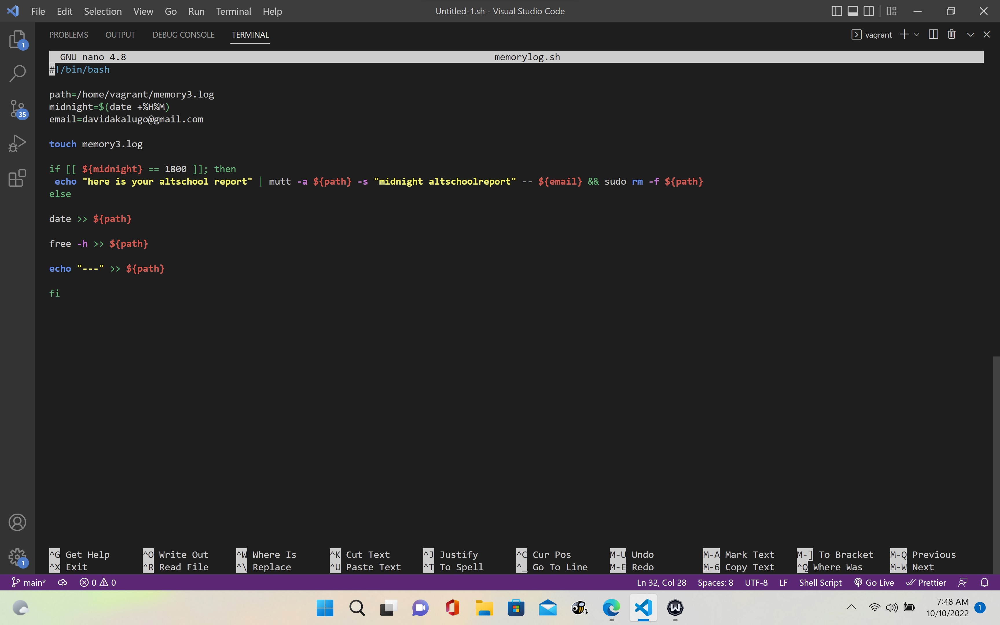
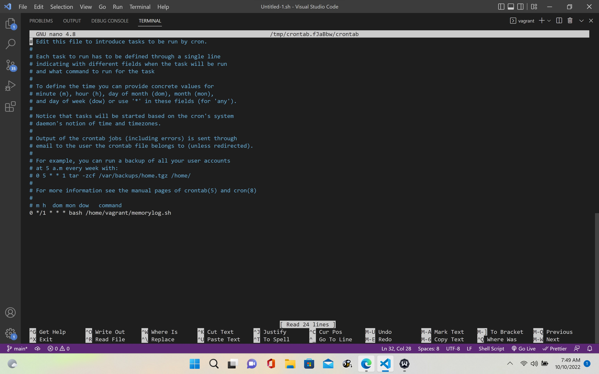
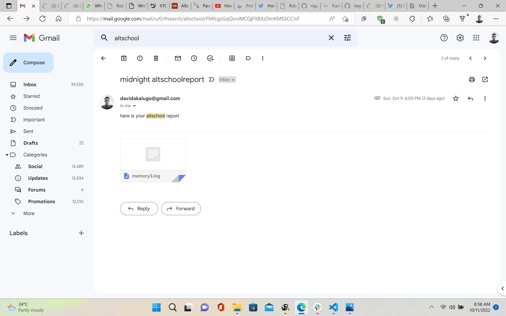
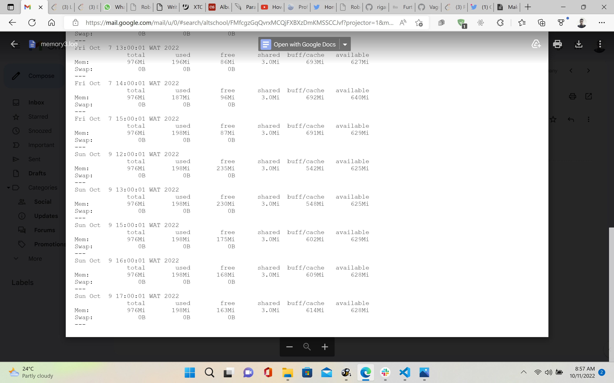
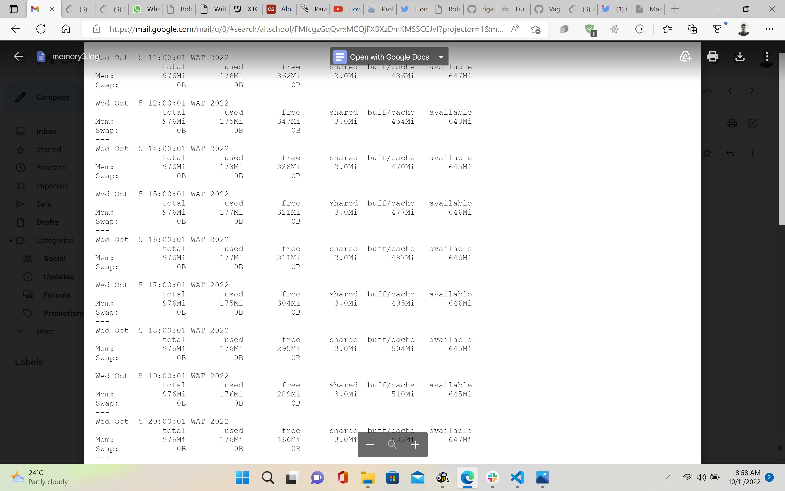
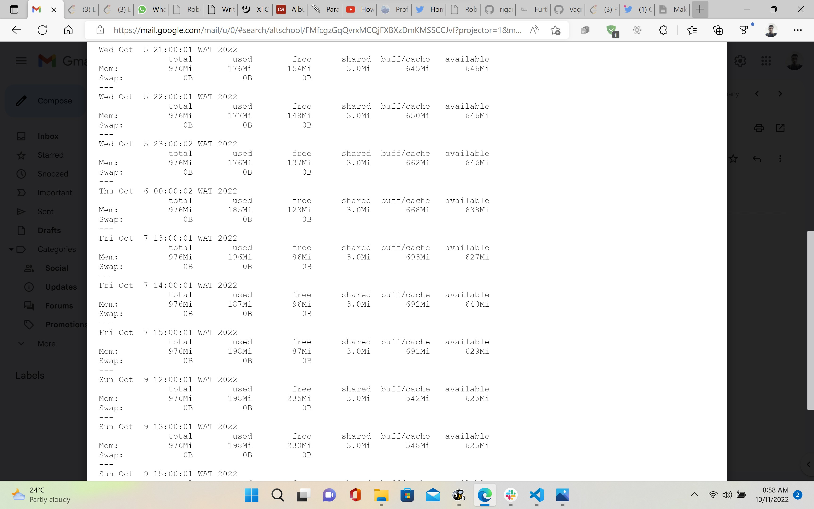

# Bash script for sending mail

# Crontab for automating the bashscript
 ## cronjob was set to repeat every hour although there were periods where it didn't run due to electricty/shutdown

# Email was received

## sample of email received

