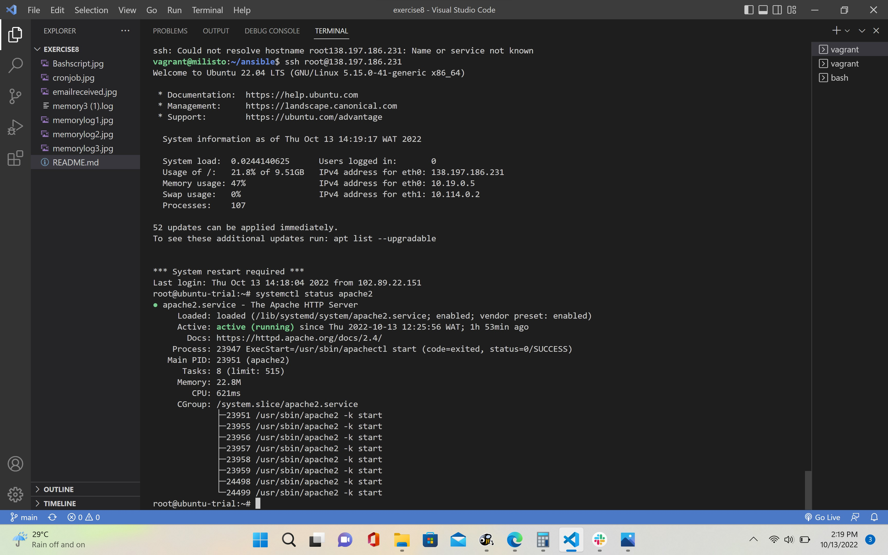

# Ansible Exercise

## Wrote the yml file (Ansible Playbook) to install apache on the Digital Ocean server, install php, replace the original html file, and host the php file.

## linked this php file that was to be hosted on the server in the ansible playbook

## after running the ansible command, the server rendered this message displaying the time and timezone

## The Apache systemctl status

