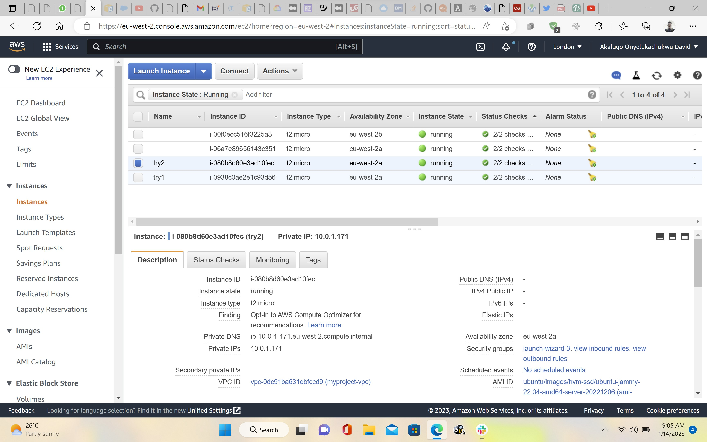

# Display Host IP on NGINX Server Without a Publicly Accessible IP

## To properly launch this project, the following AWS services were used':'

(i) VPC (Virtual Private Cloud)

(ii) Two private and public subnets

(iii) NAT Gateway

(iv) Elastic IP

(v) Application Elastic Load Balancer

(vi) Autoscale Groups

(vii) EC2 Instance

(viii) Public Bastion Host

## Step 1: Creation of VPC

A VPC with IPV4 CIDR of 10.0.0.0/16 (256 IPs) was created

## Step 2: Creation of Public and Private Subnets

Two public (myproject public and public 2) and private subnets (myproject private and private 2) were created. Public CIDRs (10.0.0.0/24 and 10.0.2.0/24) and Private CIDRs (10.0.1.0/24 and 10.0.3.0/24) had 256 possible IPs each.

## Step 3: Creation of Instances

Three instances were launched: try1, try2, and a test bastion instance. Try1 and try2 were launched in a private subnet i.e, without public ipv4 IPs, while the bastion test was created with a Public IP.

## Step 4: NAT Gateway and Elastic IP

To ensure the private instances have access to the internet, a NAT gateway with an Elastic IP was created. The NAT gateway was associated with the route table in the private subnets.

## Step 5: Creation of Target Groups

A target group (new2) with the private instances was created.

## Step 6: Attach Target Instances to Application Load Balancer

The target group with the private instance was attached to the application load balancer.

## Step 7: Auto Scale

In a separate step, I created an autoscale group (davidass) using launch configuration and an AMI that was created using one of the private instances. Autoscaling was set to a minimum of 2 instances and a maximum of 6 instances.
Autoscale group was deleted after to save me from bills.

